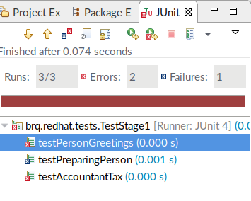
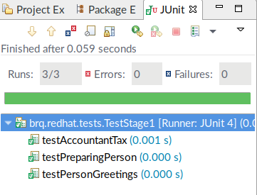

# Java Quick and Dirty - Stage1

## The Purpose

The purpose of this stage is to make you familiar with:

1. Java classes and objects
2. Java methods, calling methods, and implementing methods
3. Eclipse (JBoss Developer Studio) IDE
4. Java unit testing

## Prerequisites

* [Installed JBoss Developer Studio](https://access.redhat.com/jbossnetwork/restricted/softwareDownload.html?softwareId=53011). If you do not have access to the Customer Portal, Eclipse will do as well.

## Importing The Project

To start working on the problems presented in this exercise, first import the repository into your IDE. The assumed IDE here is JBoss Developer Studio (JBDS). To import the project:

1. Clone this repository. Alternatively, fork this repository and clone it from your fork if you want to push changes into your repository.
2. Start your JBDS.
3. Click *File* -> *Import*. Then, type `maven`.
4. Select *Existing Maven Projects* and click *next*.
5. Next to the *Root Directory* textbox, click *Browse* and navigate to the cloned repository.
6. Click the *JavaQuickAndDirty* directory and click *Ok*.
7. JBDS should recognize a new *pom.xml* file. Click *Finish*.

You can now start working on the exercise.

## What Next?

The exercise in the `Stage1` branch consists of three packages in the `src` source directory:

* brq.redhat.main
* brq.redhat.model
* brq.redhat.tests

 Your tasks are:
 
 1. Open the `brq.redhat.main.Stage1` class and read the `preparePerson` method TODO comments.
 2. Implement the `brq.redhat.model.Person` class based on the comments in the class.
 3. Implement the `brq.redhat.main.Stage1` class based on the comments in the class.
 4. Implement the `brq.redhat.main.Accountant` class based on the comments in the class.
 
 Each implementation step has a test to tell you whether you have implemented the class correctly. Open the `brq.redhat.tests.TestStage1` class. There are three tests in the class:
 
 1. `testPreparingPerson`: tests correct implementation of the `brq.redhat.main.Stage1` class.
 2. `testPersonGreetings`: tests correct implementation of the `brq.redhat.model.Person` class.
 3. `testAccountantTax`: tests correct implementation of the `brq.redhat.main.Accountant` class.
 
 To run the tests, right-click the white space in the test java class and click *Run as* -> *JUnit test*. This shows the following:
 
 
 
 As of right now, the tests fail and that is correct. When you successfully implement the classes, you will see the following:
 
 

Each failing test has a reason in the *Failure Trace* window. If you believe your implementation is correct but the test for the implementation still fails, work with the errors to understand what is incorrect. Do not change the tests. 

## Resources

How you implement the classes is up to you. For example, whether you use setters, or set private fields in a constructors does not matter to the JUnit tests. If you are lost at this stage, I recommend to read the [Java object Classes](https://www.tutorialspoint.com/java/java_object_classes.htm) tutorial. In particular, focus on the following sections: _Objects in Java_, _Classes in Java_, and _Accessing Instance Variables and Methods_. Alternatively, the [Object and Class in Java](https://www.javatpoint.com/object-and-class-in-java) article explains classes, objects, and more in an easy-to-understand manner. That should give you sufficient background to finish this exercise.